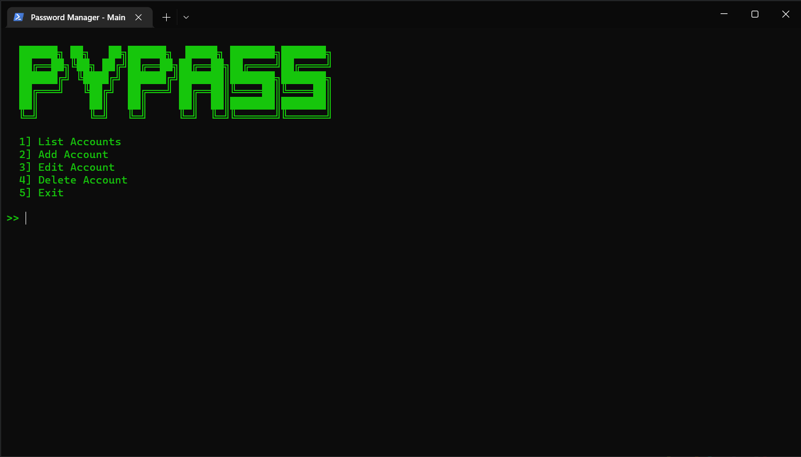

# CBSE XII Computer Science Project
## 🔒 Password Manager (Python + MySQL)

# [Documentation Template](documentation.pdf)
**This project was made in fulfillment of the requirements for appearing in AISSCE.**

A dead-simple terminal based password manager written in Python using MySQL for database. Passwords are encrypted with AES-256 using a master password for secure storage and retrieved by copying to the user's clipboard.

#### Dependencies

- [pyperclip](https://pypi.org/project/pyperclip/) (*Copy and paste clipboard functions*)
- [pycryptodome](https://pypi.org/project/pycryptodome) (*Cryptographic functions*)
- [mysql-connector-python](https://pypi.org/project/mysql-connector-python/) (*MySQL Driver*)



---

### 🚀 Setup

1. [Clone the repository](https://docs.github.com/en/github/creating-cloning-and-archiving-repositories/cloning-a-repository-from-github/cloning-a-repository). (I recommend creating a virtual environment)

```sh
git clone https://github.com/waterrmalann/CBSE-XII-CS-PROJECT.git
```

2. Install the requirements.txt.

```sh
python -m pip install -r requirements.txt
```

3. [Download and install MySQL 8.0](https://dev.mysql.com/downloads/windows/installer/8.0.html)
4. Replace 'user' and 'password' parameters from lines 17 and 18 in [program.py](program.py#L17-L18) with your MySQL username and password.
5. Run the project.
```sh
python program.py
```

---

### ⚠️ Word of Warning

Since this program was made for the mere submission as a CS Project and nothing more, very little effort was put into making it an usable piece of software. The cryptographic functions were hastily implemented and therefore may be extremely insecure and contain vulnerabilities. It is highly advised that you do not use this as your personal password manager unless you know what you are doing.

License
----

The Unlicense, see [LICENSE](LICENSE)